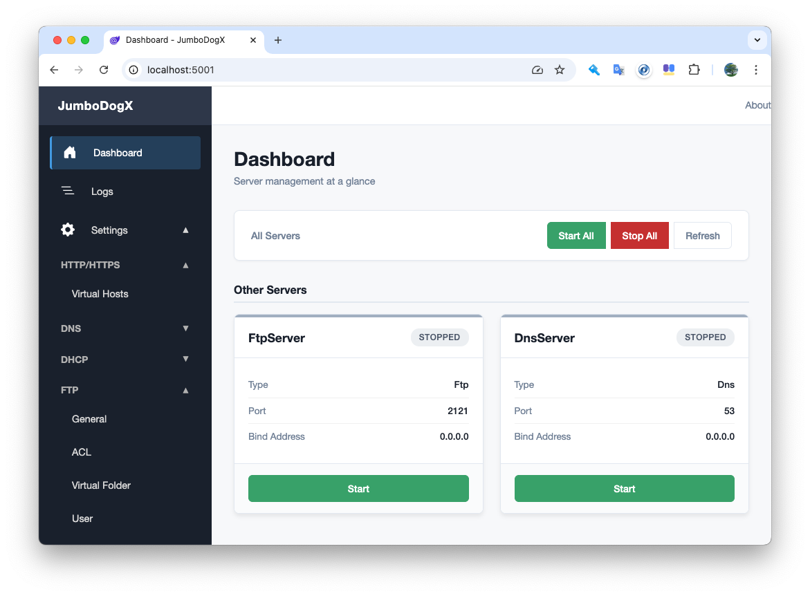
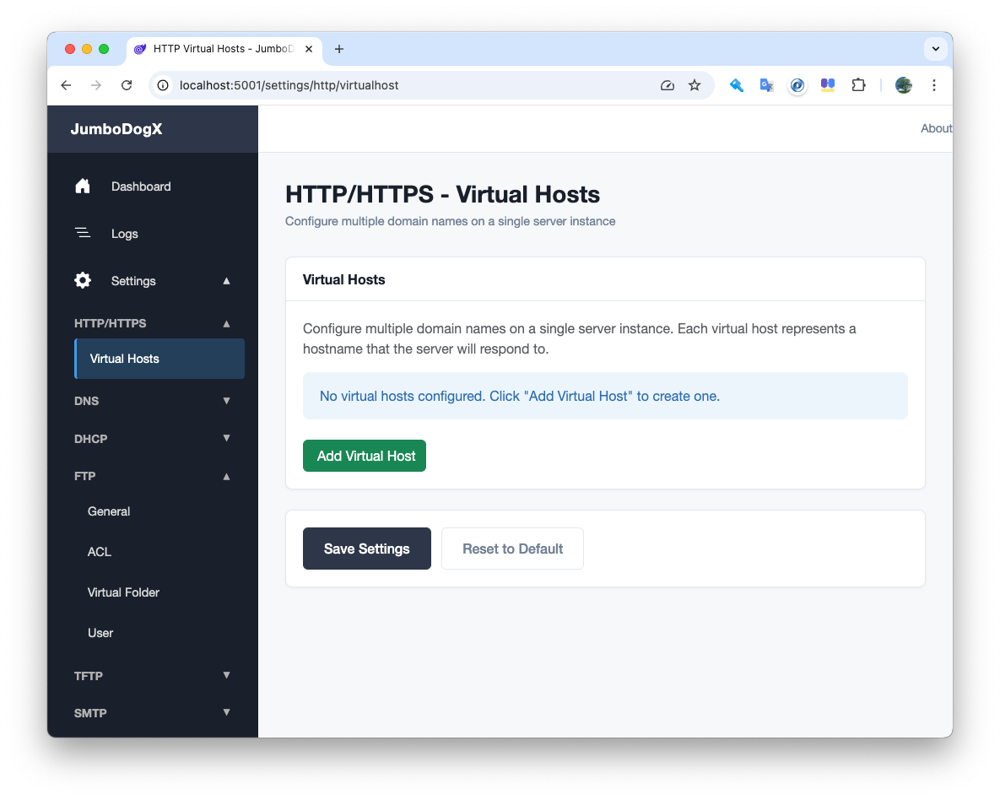
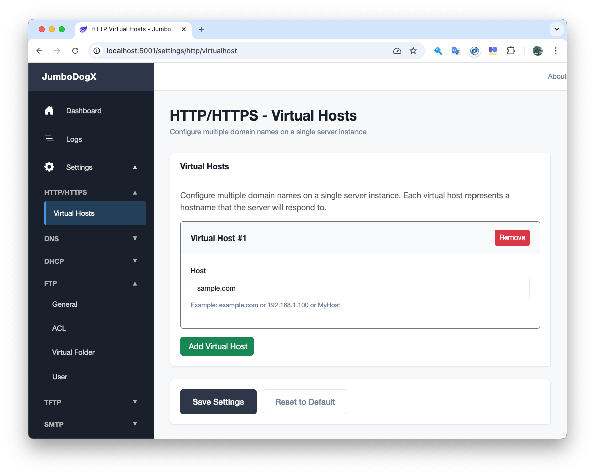
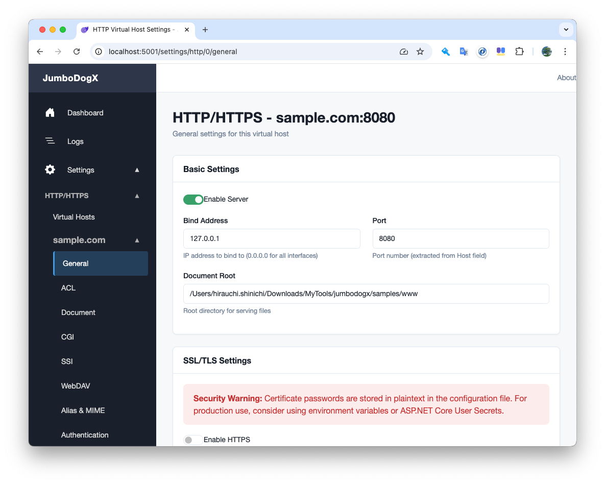
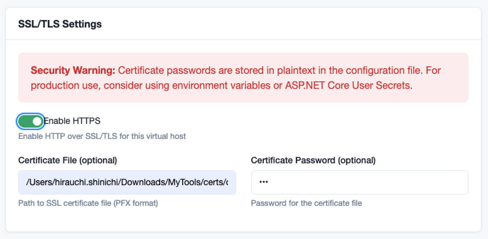
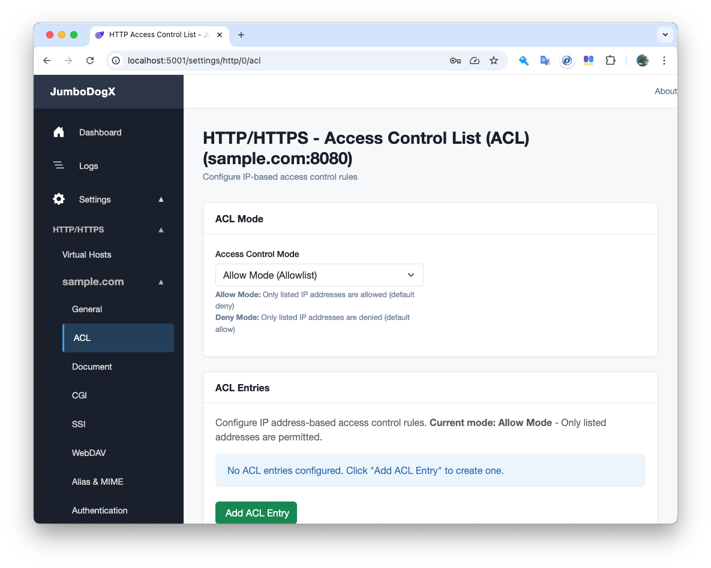
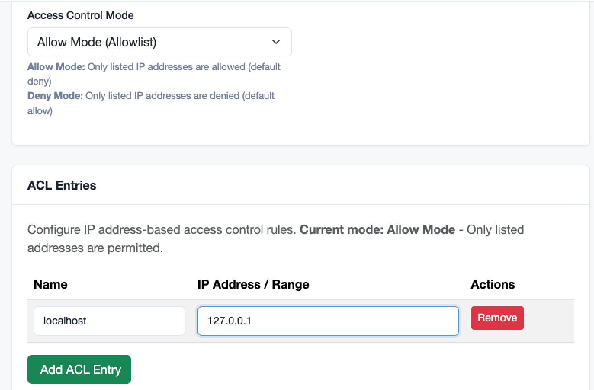
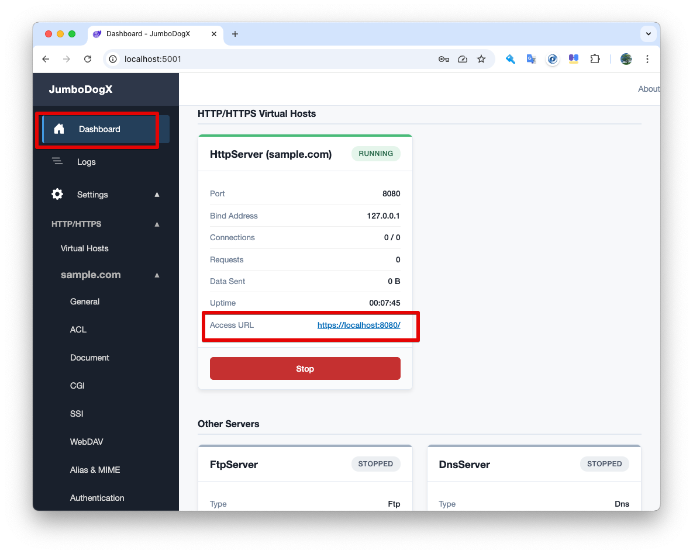
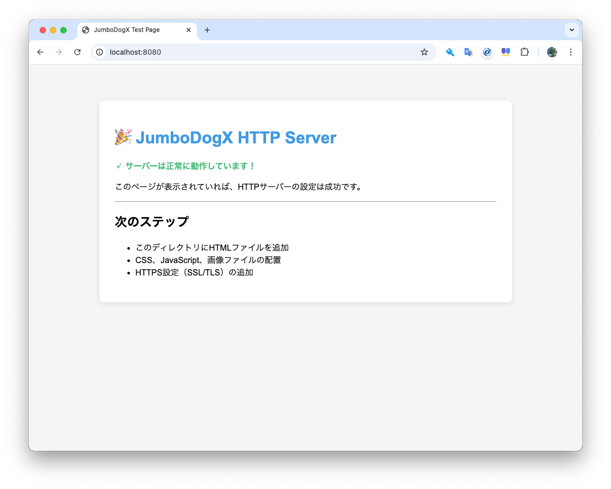

# HTTPサーバー クイックスタートガイド

このガイドでは、JumboDogXのHTTPサーバーを最短で起動し、Webサイトを公開する方法を説明します。

## 前提条件

- JumboDogXがインストールされていること
- .NET 9 Runtimeがインストールされていること

詳細は[インストール手順](../common/installation.md)を参照してください。

## ステップ1: JumboDogXの起動

### コマンドラインから起動

```bash
cd /path/to/jumbodogx
dotnet run --project src/Jdx.WebUI
```

### 起動確認

ターミナルに以下のようなメッセージが表示されれば成功です：

```
Now listening on: http://localhost:5001
Application started. Press Ctrl+C to shut down.
```

## ステップ2: Web管理画面にアクセス

ブラウザで以下のURLを開きます：

```
http://localhost:5001
```


*JumboDogXのダッシュボード画面*

## ステップ3: Virtual Hostの作成

JumboDogXのHTTP/HTTPSサーバーは、**Virtual Host（仮想ホスト）が前提**となっています。
まずは、Virtual Hostを作成する必要があります。

### 3-1. Virtual Hosts設定画面を開く

1. サイドメニューから **Settings** をクリック
2. **HTTP/HTTPS** セクションを展開
3. **Virtual Hosts** をクリック


*サイドメニューからHTTP/HTTPS > Virtual Hostsを選択*


### 3-2. Virtual Hostを追加

1. **Add Virtual Host** ボタンをクリック
2. 新しいVirtual Hostが追加されます
3. **Host** フィールドに名前を設定します（例：`sample.com`）
   - ドメイン名（例：`example.com`）
   - IPアドレス（例：`192.168.1.100`）
   - ホスト名（例：`MyHost`）
4. **Save Settings** ボタンをクリック


*Virtual Hostを追加し、Host名を設定した状態*

これで、サイドメニューのHTTP/HTTPSセクション内に「sample.com」という仮想ホストが追加されます。

## ステップ4: Virtual Hostの基本設定

### 4-1. General設定画面を開く

1. サイドメニューから **Settings** > **HTTP/HTTPS** を展開
2. 作成した仮想ホスト（例：**sample.com**）を展開
3. **General** をクリック


*Virtual HostのGeneral設定画面*

### 4-2. 基本設定を入力

以下の項目を設定します：

| 項目 | 設定値 | 説明 |
|------|--------|------|
| Enable Server | ✓ ON | サーバーを有効化 |
| Bind Address | `0.0.0.0` または `127.0.0.1` | すべてのネットワークインターフェースでリッスン（`0.0.0.0`）またはローカルのみ（`127.0.0.1`） |
| Port | `8080` | ポート番号（Virtual Host作成時に自動割り当て） |
| Document Root | `/path/to/your/website` | Webサイトのファイルがあるディレクトリ |

**Document Root の例**:
- Windows: `C:\www\html`
- macOS: `/Users/username/www/html`
- Linux: `/var/www/html`

### 4-3. HTTPS設定（オプション）

**SSL/TLS Settings** セクションで証明書を設定すると、HTTPSで通信できるようになります：

1. **Enable HTTPS** をONにする
2. **Certificate File** に証明書ファイル（PFX形式）のパスを入力
3. **Certificate Password** に証明書のパスワードを入力


*SSL/TLS Settingsセクション*

### 4-4. 設定を保存

1. **Save Settings** ボタンをクリック
2. 成功メッセージが表示されることを確認
3. **設定は即座に反映されます**（再起動不要）

## ステップ5: ACL設定（アクセス制御）

**重要**: 新規作成したVirtual Hostは、デフォルトで **ACLがAllow Mode（全てDeny）** になっています。
このままではlocalhostからもアクセスできないため、ACL設定が必要です。

### 5-1. ACL設定画面を開く

1. サイドメニューから **Settings** > **HTTP/HTTPS** を展開
2. 作成した仮想ホスト（例：**sample.com**）を展開
3. **ACL** をクリック


*サイドメニューから仮想ホスト > ACLを選択*

### 5-2. ACL Modeの確認

デフォルト設定を確認します：


| 項目 | デフォルト値 | 説明 |
|------|------------|------|
| Access Control Mode | Allow Mode (Allowlist) | リストに登録されたIPアドレスのみアクセス許可（デフォルトは全拒否） |

**Allow ModeとDeny Modeの違い**:
- **Allow Mode (Allowlist)**: リストに登録されたIPアドレスのみ許可。それ以外は全て拒否（デフォルト）
- **Deny Mode (Denylist)**: リストに登録されたIPアドレスのみ拒否。それ以外は全て許可

### 5-3. localhostからのアクセスを許可

ローカルマシンからアクセスできるように、127.0.0.1を追加します：

1. **Add ACL Entry** ボタンをクリック
2. 追加されたエントリに以下を入力：
   - **Name**: `Localhost`
   - **IP Address / Range**: `127.0.0.1`
3. **Save Settings** ボタンをクリック


*127.0.0.1を追加した状態*

### 5-4. 他のIPアドレスを追加（必要に応じて）

他のマシンからのアクセスを許可する場合は、追加でACLエントリを作成します：

**サポートされているアドレス形式**:
- **単一IP**: `192.168.1.100`
- **IPレンジ（CIDR）**: `192.168.1.0/24`
- **IPレンジ（開始-終了）**: `192.168.1.1-192.168.1.254`
- **ワイルドカード**: `192.168.1.*` (192.168.1.0-192.168.1.255にマッチ)

**例**:
- ローカルネットワーク全体を許可: `192.168.1.0/24`
- 特定のIPアドレスのみ許可: `192.168.1.100`

### 5-5. 注意事項

<div class="alert alert-warning">
<strong>重要:</strong> Allow Modeを使用する場合は、自分のIPアドレスを必ず追加してください！
追加せずに保存すると、自分自身もアクセスできなくなる可能性があります。
</div>

## ステップ6: テストページの配置

### 6-1. テストHTMLファイルを作成

Document Rootに指定したディレクトリに `index.html` を作成します：

```html
<!DOCTYPE html>
<html lang="ja">
<head>
    <meta charset="UTF-8">
    <meta name="viewport" content="width=device-width, initial-scale=1.0">
    <title>JumboDogX Test Page</title>
    <style>
        body {
            font-family: Arial, sans-serif;
            max-width: 800px;
            margin: 50px auto;
            padding: 20px;
            background: #f5f5f5;
        }
        .container {
            background: white;
            padding: 30px;
            border-radius: 8px;
            box-shadow: 0 2px 10px rgba(0,0,0,0.1);
        }
        h1 {
            color: #4299E1;
        }
        .success {
            color: #48BB78;
            font-weight: bold;
        }
    </style>
</head>
<body>
    <div class="container">
        <h1>🎉 JumboDogX HTTP Server</h1>
        <p class="success">✓ サーバーは正常に動作しています！</p>
        <p>このページが表示されていれば、HTTPサーバーの設定は成功です。</p>
        <hr>
        <h2>次のステップ</h2>
        <ul>
            <li>このディレクトリにHTMLファイルを追加</li>
            <li>CSS、JavaScript、画像ファイルの配置</li>
            <li>HTTPS設定（SSL/TLS）の追加</li>
            <li>Virtual Hostで複数サイトを運用</li>
        </ul>
    </div>
</body>
</html>
```

### 6-2. ファイル構成の例

```
/path/to/your/website/
├── index.html          # トップページ
├── about.html          # 他のページ
├── css/
│   └── style.css       # スタイルシート
├── js/
│   └── script.js       # JavaScript
└── images/
    └── logo.png        # 画像ファイル
```

## ステップ7: 動作確認

### 7-1. Dashboardで確認

1. サイドメニューから **Dashboard** をクリック
2. **HTTP/HTTPS Virtual Hosts** セクションに作成した仮想ホストが表示されます
3. Virtual Hostのステータス、ポート、Bind Addressなどが確認できます
4. サーバーが起動している場合、**Access URL** のリンクが表示されます


*DashboardのHTTP/HTTPS Virtual Hostsセクション*

### 7-2. ブラウザでアクセス

Access URLのリンクをクリックするか、以下のURLにアクセスします：

```
http://localhost:8080
```

作成したテストページが表示されれば成功です！


*サンプルページ*


## よくある問題と解決方法

### ページが表示されない

**原因1: ACLで拒否されている**

新規作成したVirtual HostはデフォルトでACLがAllow Mode（全てDeny）になっているため、ACL設定が必要です。

**解決策**:
1. Settings > HTTP/HTTPS > 仮想ホスト > ACL を開く
2. "Add ACL Entry"で`127.0.0.1`を追加
3. "Save Settings"をクリック

**原因2: ポートが使用中**
```bash
# ポートの使用状況を確認（macOS/Linux）
lsof -i :8080

# ポートの使用状況を確認（Windows）
netstat -ano | findstr :8080
```

**解決策**: 別のポート番号（例：8081、8082）を使用する

**原因3: Document Rootのパスが間違っている**

- パスが正しいか確認
- パスに日本語や特殊文字が含まれていないか確認
- 絶対パスを使用する

**原因4: ファイルのアクセス権限**

```bash
# ディレクトリに読み取り権限があるか確認（macOS/Linux）
ls -la /path/to/your/website

# 必要に応じて権限を付与
chmod -R 755 /path/to/your/website
```

### "Connection refused" エラー

**原因**: サーバーが起動していない

**解決策**:
1. ターミナルでサーバーが起動しているか確認
2. ログで "Server started successfully" メッセージを確認

### "Bind Address" エラー

**原因**: 指定したアドレスにバインドできない

**解決策**: `0.0.0.0` または `127.0.0.1` を使用する

## 次のステップ

基本的なHTTPサーバーが動作したら、以下のドキュメントで更に機能を拡張できます：

- [詳細設定](configuration.md) - Keep-Alive、ETag、カスタムヘッダーなど
- [SSL/TLS設定](ssl-tls.md) - HTTPSで暗号化通信を実現
- [Virtual Host設定](virtual-hosts.md) - 複数のドメインを運用
- [CGI/SSI設定](cgi-ssi.md) - 動的コンテンツを生成
- [WebDAV設定](webdav.md) - Webベースでファイル管理

## 設定ファイルでの設定（上級者向け）

Web UIの代わりに、直接設定ファイルを編集することもできます：

### appsettings.json の場所

```
src/Jdx.WebUI/appsettings.json
```

### Virtual Host設定の例

```json
{
  "Jdx": {
    "HttpServer": {
      "VirtualHosts": [
        {
          "Host": "sample.com:8080",
          "Enabled": true,
          "BindAddress": "0.0.0.0",
          "Settings": {
            "Protocol": "HTTP",
            "DocumentRoot": "/path/to/your/website",
            "WelcomeFileName": "index.html",
            "TimeOut": 3,
            "MaxConnections": 100,
            "CertificateFile": "",
            "CertificatePassword": ""
          }
        }
      ]
    }
  }
}
```

**HTTPS設定の例**:
```json
{
  "Settings": {
    "Protocol": "HTTPS",
    "DocumentRoot": "/path/to/your/website",
    "CertificateFile": "/path/to/certificate.pfx",
    "CertificatePassword": "your-password"
  }
}
```

設定ファイルを編集した後は、JumboDogXを再起動してください。

## まとめ

これで、JumboDogXのHTTPサーバーが起動し、Webページを公開できるようになりました！

### 完了したこと
✓ JumboDogXの起動
✓ Virtual Hostの作成（JumboDogXはVirtual Host前提のアーキテクチャ）
✓ Virtual Hostの基本設定
✓ ACL設定（アクセス制御）- localhostからのアクセスを許可
✓ テストページの作成と確認
✓ Dashboardでの動作確認

### 重要なポイント
- JumboDogXのHTTP/HTTPSサーバーは**Virtual Host（仮想ホスト）が前提**
- **新規Virtual HostはデフォルトでACLがAllow Mode（全てDeny）** - 127.0.0.1の追加が必須
- 設定は即座に反映されるため、再起動は不要
- DashboardのHTTP/HTTPS Virtual Hostsセクションで状態を確認
- Access URLのリンクから直接アクセス可能

### 次にできること
- HTTPS化してセキュアな通信を実現（証明書の設定）
- 複数のVirtual Hostで複数サイトを運用
- CGI/SSIで動的コンテンツを提供
- アクセス制御で特定のIPアドレスのみ許可

さらに詳しい設定は、各マニュアルを参照してください。
